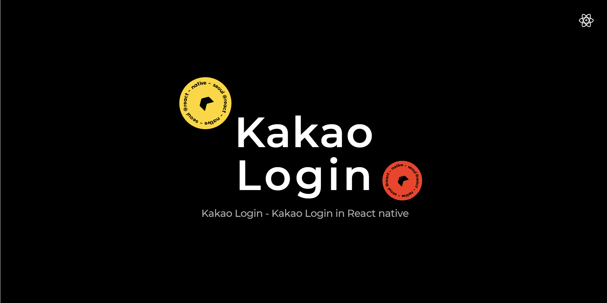

# @react-native-seoul/kakao-login



[](https://npmjs.org/package/@react-native-seoul/kakao-login)
[](https://npmjs.org/package/@react-native-seoul/kakao-login)
[](https://npmjs.org/package/@react-native-seoul/kakao-login)
[](https://github.com/crossplatformkorea/react-native-kakao-login/actions/workflows/ci.yml)
[](https://github.com/crossplatformkorea/react-native-kakao-login/actions/workflows/ci-deploy.yml)

React Native 카카오 로그인 라이브러리 입니다. `@react-native-seoul/kakao-login` < 3.0 이하 버전을 쓰시는 분들은 [DEPRECATED README](https://github.com/crossplatformkorea/react-native-kakao-login/blob/main/README_DEPRECATED.md)를 참고해주세요.

세부 예제는 KakaoLoginExample 폴더 안의 예제 프로젝트를 확인해주세요.
해당 라이브러리는 `flow`와 `typescript`를 지원합니다.

## Changelogs

[Changelogs 링크](./CHANGELOG.md)

## Demo

[카카오 로그인 Example Project](https://github.com/crossplatformkorea/react-native-kakao-login/tree/main/KakaoLoginExample) 데모 화면


> 위 프로젝트는 `KakaoLoginExample` 폴더에서 확인 가능합니다.

## Tutorial

> 라이브러리를 더욱 편리하게 사용하기 위해서 Youtube 영상을 제작했습니다.

- [iOS에서 사용하기 Youtube](https://www.youtube.com/watch?v=uCn1xIijuos&list=PLMu8UG37vF6oJLNhjsjoy_ApcJFZZwJOo)

- [Android에서 사용하기 Youtube](https://www.youtube.com/watch?v=YJaOT3ZVKNg&list=PLMu8UG37vF6oJLNhjsjoy_ApcJFZZwJOo)

## Getting started

해당 라이브러리는 `3.0.0` 이후 부터는 react-native `0.61`이상을 지원합니다. 카카오 라이브러리 지원이 아래 버전부터는 지원이 끊길 예정이므로 참고해주시기 바랍니다. 과거에는 [카카오 라이브러리 레거시 iOS](https://developers.kakao.com/docs/latest/ko/kakaologin/ios-v1)와 [카카오 라이브러리 레거시 Android](https://developers.kakao.com/docs/latest/ko/kakaologin/android-v1) 버전을 쓰고 있었습니다.

## Installation

```
yarn add @react-native-seoul/kakao-login
```

React Native 0.60.X이상부터는 `Auto linking`을 지원합니다. 따라서 설치는 매우 간편합니다.

iOS의 경우 `yarn add @react-native-seoul/kakao-login` 이후 `npx pod-install` 명령어로 pod 라이브러리만 추가로 설치해주시면 됩니다.

## Post Installation

> 설치가 제대로 되지 않는다면 example project의 설정을 참고하세요 👍

#### iOS

1. Pod에서 iOS deployment target이 `13.0` 이상이어야 합니다.

2. ios 카카오 sdk 설치 후의 설정과 관련해서는 [공식문서 - 카카오 로그인 > 설정하기](https://developers.kakao.com/docs/latest/ko/kakaologin/prerequisite)를 참고해주세요. 해당 가이드를 통해 카카오 개발자 페이지에서 본인의 어플리케이션을 생성해주세요.

3. [공식문서 - iOS > 시작하기](https://developers.kakao.com/docs/latest/ko/ios/getting-started#project) 을 참고하여 `Podfile`, `URL Types` 등 필요한 세팅을 프로젝트에 추가해줍니다.

   **Podfile** — 카카오 SDK 전체가 아니라 필요한 모듈만 추가합니다.

   ```ruby
   pod 'KakaoSDKCommon'  # 필수 요소를 담은 공통 모듈
   pod 'KakaoSDKAuth'    # 사용자 인증
   pod 'KakaoSDKUser'    # 카카오 로그인, 사용자 관리
   ```

   추가 후 `cd ios && pod install` 로 다시 설치해줍니다.
   ([#328](https://github.com/crossplatformkorea/react-native-kakao-login/pull/328) 부터
   전체 SDK 대신 필요한 모듈만 설치되도록 변경되었습니다.)

   **URL Schemes** — `Info` > `URL Types` > `URL Schemes` 에 네이티브 앱 키를
   `kakao${NATIVE_APP_KEY}` 형식으로 등록합니다.
   아래 `카카오 네이티브앱 아이디를 적어주세요` 문구를 잘 확인하시고 본인의
   Kakao App Key 로 변경해주세요.

```diff
 <key>CFBundleURLTypes</key>
 <array>
+ <dict>
+   <key>CFBundleTypeRole</key>
+   <string>Editor</string>
+   <key>CFBundleURLSchemes</key>
+   <array>
+     <string>kakao{카카오 네이티브앱 아이디를 적어주세요}</string>
+   </array>
+ </dict>
 </array>
 <key>CFBundleVersion</key>
 <string>1</string>
+ <key>KAKAO_APP_KEY</key>
+ <string>{카카오 네이티브앱 아이디를 적어주세요}</string>
+ <key>KAKAO_APP_SCHEME</key> // 선택 사항 멀티 플랫폼 앱 구현 시에만 추가하면 됩니다
+ <string>{카카오 앱 스킴을 적어주세요}</string> // 선택 사항
+ <key>LSApplicationQueriesSchemes</key>
+ <array>
+   <string>kakaokompassauth</string>
+   <string>storykompassauth</string>
+   <string>kakaolink</string>
+ </array>
```

4. `3.0.0` 버전부터는 swift 버전의 kakao sdk를 활용하므로 [Swift Bridging Header](https://stackoverflow.com/questions/31716413/xcode-not-automatically-creating-bridging-header)를 추가해야할 수 있습니다.
   

5. `AppDelegate.m` 파일에 [해당 부분](https://github.com/react-native-seoul/react-native-kakao-login/issues/193#issuecomment-806475082)을 추가해주세요. 이는 카카오톡 앱이 깔려 있을시 올바로 데이터를 받아오기 위함입니다 [#193](https://github.com/react-native-seoul/react-native-kakao-login/issues/193).

6. Project => Targets 아래 앱 선택 => General 탭으로 이동해서 Bundle Identifier가 본인의 카카오 앱과 동일한지 확인해주세요.

7. 여러 라이브러리에서 동일한 버전의 SDK를 써야 하는 경우 `Podfile`에 아래와 같이 추가하여 SDK 버전을 강제로 지정할 수 있습니다.

   ```ruby
   # 없는 경우에는 package.json의 sdkVersions.ios.kakao를 따릅니다.
   $KakaoSDKVersion=YOUR_KAKAO_SDK_VERSION
   ```

#### Android

1. [키 해시 등록](https://developers.kakao.com/docs/latest/ko/android/getting-started#before-you-begin-add-key-hash)을 진행해주세요. 자바 코드로 구하는 방법이 제일 확실합니다.

   ```
   AUTHORIZATION_FAILED: invalid android_key_hash or ios_bundle_id or web_site_url
   ```

   React Native 0.60.x 부터 템플릿에 기본적으로 디버그 키스토어가 포함되어 있습니다. (`project/android/app`에 디버그 키스토어가 존재합니다.)<br/>
   기본 디버그 키스토어의 key hash 는 `Xo8WBi6jzSxKDVR4drqm84yr9iU=` 를 사용하시면 됩니다.

   > 템플릿에서 기본 제공되는것 이외의 키스토어에서 key hash 를 추출하기 위해서는 아래의 명령어를 사용하세요
   >
   > **글로벌 debug keystore 에서 key hash 추출**
   >
   > ```
   > keytool -exportcert -alias androiddebugkey -keystore ~/.android/debug.keystore -storepass android -keypass android | openssl sha1 -binary | openssl base64
   > ```
   >
   > **특정 경로의 keystore 에서 key hash 추출**
   >
   > ```
   > keytool -exportcert -alias {my-app-key-alias} -keystore {your-key-path}/{my-app-key}.keystore -storepass android -keypass android | openssl sha1 -binary | openssl base64
   > ```

2. Redirect URI 설정
   - 카카오 로그인 기능을 구현하기 위해서는 리다이렉션(Redirection)을 통해 [Request Code](https://developers.kakao.com/docs/latest/ko/kakaologin/android)를 받아야 합니다. 그러기 위해서는 아래 코드를 `AndroidManifest.xml`에 추가해주세요. 그리고 `카카오 네이티브 앱 key를 입력해주세요` 텍스트를 본인의 카카오 네이티브 키로 변경해주시면 됩니다. (Android 12(API 31) 이상을 타깃으로 하는 앱인 경우, `exported` 요소를 반드시 "true"로 선언해야 합니다.)

     ```xml
     <activity
        android:name="com.kakao.sdk.auth.AuthCodeHandlerActivity"
        android:exported="true">
       <intent-filter>
           <action android:name="android.intent.action.VIEW" />
           <category android:name="android.intent.category.DEFAULT" />
           <category android:name="android.intent.category.BROWSABLE" />

           <!-- Redirect URI: "kakao{NATIVE_APP_KEY}://oauth“ -->
           <data android:host="oauth"
               android:scheme="kakao{카카오 네이티브 앱 key를 입력해주세요}" />
       </intent-filter>
     </activity>
     ```

3. `app/src/main/res/values/strings.xml` 을 열어 다음을 추가합니다

   ```diff
   <resources>
       <string name="app_name">KakaoLoginExample</string>
   +   <string name="kakao_app_key">your_app_key</string>
   </resources>
   ```

4. [공식문서-토큰관리](https://developers.kakao.com/docs/latest/ko/kakaologin/android#token-mgmt) 에서 참고할 수 있듯이 Android 카카오 SDK는 액세스 토큰을 자동 갱신해줍니다.

5. 컴파일 에러가 나면 `build.gradle`에서 android sdk compile version 등 빌드 sdk 버전을 맞춰주세요.

6. (Optional) 앱 배포 시, 코드 축소, 난독화, 최적화(`minifyEnabled true`)를 하는 경우 참고해주세요.

   **별도 설정이 필요하지 않습니다.** 이 라이브러리는 [android/consumer-rules.pro](./android/consumer-rules.pro)를 통해 카카오 SDK와 SDK가 내부적으로 사용하는 Retrofit / OkHttp 의 ProGuard 규칙을 자동으로 포함하며, AGP가 이를 앱 빌드에 자동으로 병합합니다. R8 full mode(AGP 8 부터 기본값)에서도 그대로 동작합니다.

   > 반대로 [공식 문서](https://developers.kakao.com/docs/latest/ko/android/getting-started#project-pro-guard)의 규칙만 직접 추가한 경우에는 release 빌드가 실패하거나 로그인 시 크래시가 발생할 수 있습니다 ([#438](https://github.com/crossplatformkorea/react-native-kakao-login/issues/438)).
   >
   > - 카카오 SDK가 사용하는 Retrofit 2.9.0 은 자체 ProGuard 규칙을 배포하지만, Retrofit 2.10/2.11 에서 추가된 R8 full mode 대응 규칙(서비스 인터페이스의 제네릭 반환 타입 보존 등)이 빠져 있습니다.
   > - 카카오 SDK가 사용하는 OkHttp 4.9.3 에는 bouncycastle / conscrypt / openjsse `-dontwarn` 규칙이 없어, 이 규칙이 없으면 R8 이 `Missing classes` 오류로 빌드 자체를 실패시킵니다.

   규칙을 직접 관리해야 하는 경우(autolinking 미사용 등)에는 [android/consumer-rules.pro](./android/consumer-rules.pro) 의 내용을 그대로 `proguard-rules.pro` 에 복사해주세요. 각 규칙이 필요한 이유는 해당 파일에 주석으로 정리되어 있습니다.

7. Gradle 및 카카오 SDK의 버전을 변경해야 하는 경우, [android/gradle.properties](./android/gradle.properties) 에 있는 항목들을 확인하고, Android gradle의 root project의 ext에 `RNKakaoLogins_` 를 제외한 버전을 명시해주세요.

#### EXPO (Expo Go, Snack 사용 불가, Development Build(EAS, local build)만 가능)

1. Android의 Kakao SDK Maven Repository를 선언하기 위해 필요한 의존성을 추가합니다.

```sh
npx expo install expo-build-properties
```

2. app.json 파일을 아래와 같이 수정합니다.

```
{
  "expo": {
    ...
    "plugins": [
      ...,
      [
        "@react-native-seoul/kakao-login",
        {
          "kakaoAppKey": "{{kakao api key}}",
          "overrideKakaoSDKVersion": "2.11.2" // Optional
        }
      ],
      [
        "expo-build-properties",
        {
          "android": {
            "extraMavenRepos": ["https://devrepo.kakao.com/nexus/content/groups/public/"]
          }
        }
      ]
    ],
    ...
  }
}
```

3. (Optional) Android에서 난독화(`minifyEnabled: true`)를 사용하실 경우에도 **별도 설정이 필요하지 않습니다.** autolinking 으로 연결된 이 라이브러리의 [consumer-rules.pro](./android/consumer-rules.pro) 가 카카오 SDK / Retrofit / OkHttp 관련 ProGuard 규칙을 자동으로 포함하므로, `prebuild` 이후 생성되는 `android/app/proguard-rules.pro` 에 별도로 규칙을 주입할 필요가 없습니다. 그 밖의 커스터마이징이 필요한 경우에만 [Expo BuildProperties](https://docs.expo.dev/versions/latest/sdk/build-properties/) 를 사용해주세요.

## Methods

| Func                  | Param |            Return             | Description                                                                                                        |
| :-------------------- | :---: | :---------------------------: | :----------------------------------------------------------------------------------------------------------------- |
| login                 |       |   Promise{KakaoOAuthToken}    | 로그인 (카카오톡에 접근할 수 없다면 loginWithKakaoAccount 호출)                                                    |
| loginWithKakaoAccount |       |   Promise{KakaoOAuthToken}    | 카카오계정으로 로그인 (기본 웹 브라우저(CustomTabs)에 있는 카카오계정 cookie 로 사용자를 인증하고 OAuthToken 발급) |
| getProfile            |       |     Promise{KakaoProfile}     | 프로필 불러오기                                                                                                    |
| logout                |       |        Promise{string}        | 로그아웃                                                                                                           |
| unlink                |       |        Promise{string}        | 연결끊기                                                                                                           |
| getAccessToken        |       | Promise{KakaoAccessTokenInfo} | 액세스 토큰 조회                                                                                                   |

#### 프로필 가져오기 - `getProfile` => `KakaoProfile`

|                          | iOS | Android |    type    |                                         Description                                         |
| ------------------------ | :-: | :-----: | :--------: | :-----------------------------------------------------------------------------------------: |
| `accessToken`            |  ✓  |    ✓    |  `string`  |                                            토큰                                             |
| `refreshToken?`          |  ✓  |    ✓    |  `string`  |                                        리프레쉬 토큰                                        |
| `idToken?`               |  ✓  |    ✓    |  `string`  |                      OpenID Connect 확장 기능을 통해 발급되는 ID 토큰                       |
| `accessTokenExpiresAt?`  |  ✓  |    ✓    |   `Date`   |                                       토큰 만료 시간                                        |
| `refreshTokenExpiresAt?` |  ✓  |    ✓    |   `Date`   | 리프레쉬 토큰 만료 시간, 구버전 SDK로 이미 로그인이 되어있었다면 null이 반환될 수 있습니다. |
| `scopes`                 |  ✓  |    ✓    | `string[]` |                                   사용자로 부터 받은 권한                                   |

#### 배송지 가져오기 - `shippingAddresses` => `KakaoShippingAddresses`

|                     | iOS | Android |   type    |                Description                 |
| ------------------- | :-: | :-----: | :-------: | :----------------------------------------: |
| `userId`            |  ✓  |    ✓    | `string`  |                 사용자 Id                  |
| `needsAgreement`    |  ✓  |    ✓    | `boolean` | 배송지 제공에 대한 사용자의 동의 필요 여부 |
| `shippingAddresses` |  ✓  |    ✓    |  `Array`  |        사용자가 소유한 배송지 목록         |

##### 배송지 정보 (KakaoShippingAddress)

|                        | iOS | Android |   type    |                                Description                                |
| ---------------------- | :-: | :-----: | :-------: | :-----------------------------------------------------------------------: |
| `id`                   |  ✓  |    ✓    | `string`  |                               배송지 아이디                               |
| `name`                 |  ✓  |    ✓    | `string`  |                                 배송지명                                  |
| `isDefault`            |  ✓  |    ✓    | `boolean` |                             기본 배송지 여부                              |
| `updatedAt`            |  ✓  |    ✓    |  `Date`   |                        마지막 배송지정보 수정시각                         |
| `type`                 |  ✓  |    ✓    | `string`  |                           배송지 타입(Old, New)                           |
| `baseAddress`          |  ✓  |    ✓    | `string`  |               주소 검색을 통해 자동으로 입력되는 기본 주소                |
| `detailAddress`        |  ✓  |    ✓    | `string`  |                      기본 주소에 추가하는 상세 주소                       |
| `receiverName`         |  ✓  |    ✓    | `string`  |                                수령인 이름                                |
| `receiverPhoneNumber1` |  ✓  |    ✓    | `string`  |                               수령인 연락처                               |
| `receiverPhoneNumber2` |  ✓  |    ✓    | `string`  |                            수령인 추가 연락처                             |
| `zoneNumber`           |  ✓  |    ✓    | `string`  | 도로명 주소 우편번호. 배송지 타입이 NEW(도로명 주소)인 경우 반드시 존재함 |
| `zipCode`              |  ✓  |    ✓    | `string`  |  지번 주소 우편번호. 배송지 타입이 OLD(지번 주소)여도 값이 없을 수 있음   |

#### 서비스 약관 동의 내역 확인하기 -> `serviceTerms` => `KakaoUserServiceTerms`

> [카카오싱크](https://developers.kakao.com/docs/latest/ko/kakaosync/common#intro)를 도입한 서비스만 사용할 수 있는 기능입니다.

|                | iOS | Android |          type          |       Description       |
| -------------- | :-: | :-----: | :--------------------: | :---------------------: |
| `userId`       |  ✓  |    ✓    |       `number?`        |        회원 번호        |
| `serviceTerms` |  ✓  |    ✓    | `KakaoServiceTerms[]?` | 조회한 서비스 약관 목록 |

##### 조회한 서비스 약관 목록 (KakaoServiceTerms)

|             | iOS | Android |   type    |               Description                |
| ----------- | :-: | :-----: | :-------: | :--------------------------------------: |
| `tag`       |  ✓  |    ✓    | `string`  | 3rd에서 동의한 약관의 항목들을 정의한 값 |
| `agreed`    |  ✓  |    ✓    | `boolean` |                동의 여부                 |
| `agreedAt`  |  ✓  |    ✓    | `string?` |              최근 동의 시각              |
| `required`  |  ✓  |    ✓    | `boolean` |              필수 동의 여부              |
| `revocable` |  ✓  |    ✓    | `boolean` |              철회 가능 여부              |

#### React-native-web

1.RestApiKey랑 redirectUrl을 포함한 아래 링크로 href 링크를 열어서 code를 가져옵니다
const kakaoUrl = `https://kauth.kakao.com/oauth/authorize?client_id=${restApiKey}&redirect_uri=${redirectUrl}&response_type=code`;

redirectUrl이 <http://localhost:3000> 일때 아래와같이 redirectUrl에 code파라미터가 붙은 url이 들어와집니다

<http://localhost:3000/?code=Ss32OM1_yUybn5dtEQ-XT8EZfV24BKC_GIeIvFPz7_wHorYXtij9JFQcMuGtGdzxQc3Vlwopb1UAAAGCizvuCw>
code= 뒤쪽부분을 split해서 토큰 발급시 필요한 code를 얻을 수 있습니다
react-native-web에서는 app과 다르게 restApikey, redirecturl을 code와 같이 직접 넣어줘야 합니다

## Methods (Web)

| Func                  |                 Param                  |             Return              | Description          |
| :-------------------- | :------------------------------------: | :-----------------------------: | :------------------- |
| login                 | restApiKeyWeb, redirectUrlWeb, codeWeb |   Promise{KakaoOAuthWebToken}   | 로그인               |
| loginWithKakaoAccount |                                        |                                 | 웹 지원 x            |
| getProfile            |                tokenWeb                |      Promise{KakaoProfile}      | 프로필 불러오기      |
| shippingAddresses     |                tokenWeb                | Promise{KakaoShippingAddresses} | 배송지 정보 불러오기 |
| logout                |                tokenWeb                |         Promise{string}         | 로그아웃             |
| unlink                |                tokenWeb                |         Promise{string}         | 연결끊기             |
| getAccessToken        |                                        |                                 | 웹 지원 x            |

## Usage

### Sample Code

```js
const signInWithKakao = async (): Promise<void> => {
  const token: KakaoOAuthToken = await login();

  setResult(JSON.stringify(token));
};

const signOutWithKakao = async (): Promise<void> => {
  const message = await logout();

  setResult(message);
};

const getKakaoProfile = async (): Promise<void> => {
  const profile: KakaoProfile = await getProfile();

  setResult(JSON.stringify(profile));
};

const getKakaoShippingAddresses = async (): Promise<void> => {
  const addresses: KakaoShippingAddresses = await shippingAddresses();

  setResult(JSON.stringify(addresses));
};

const getKakaoServiceTerms = async (): Promise<void> => {
  const serviceTerms: KakaoUserServiceTerms = await serviceTerms();

  setResult(JSON.stringify(serviceTerms))
}

const unlinkKakao = async (): Promise<void> => {
  const message = await unlink();

  setResult(message);
};
```

### How to run example project

1. `clone` 받은 레포에서 `KakaoLoginExample` 폴더로 이동합니다

   ```bash
   cd KakaoLoginExample
   ```

2. 필요한 모듈을 설치 합니다(`preinstall`이 실행됩니다)

   ```bash
   yarn
   ```

3. 프로젝트 실행

- `KAKAO_APP_KEY`등 필요한 SDK 연동 설정은 기본으로 되어 있습니다.
  - 본인 앱의 키로 변경하고 테스트 하셔도 무방합니다. 단 `PR`을 날리실 때는 삭제하고 날려주세요.
- `yarn start`
- `yarn ios` or `yarn android`로 앱 실행
  - `iOS` 앱이 실행되지 않을 때는 `XCode`를 열고 테스트 해주세요. 이는 RN `0.64.0`에서 발생되고 있는 문제입니다.
- ios의 경우 `ios`폴더에서 `pod install`을 먼저 실행해 주세요. 프로젝트 폴더에서 `npx pod-install`로 이용하셔도 무방합니다.
