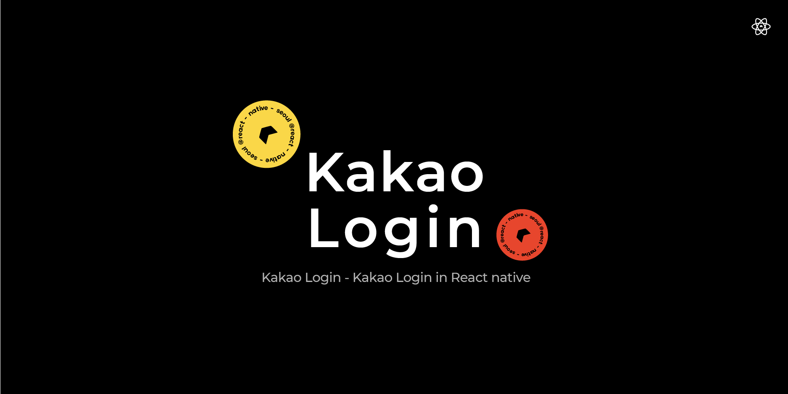

# @react-native-seoul/kakao-login


<p align="left">
  <a href="https://npmjs.org/package/@react-native-seoul/kakao-login">
    
  </a>
  <a href="https://npmjs.org/package/@react-native-seoul/kakao-login">
    
  </a>
  <a href="https://npmjs.org/package/@react-native-seoul/kakao-login">
    
  </a>
</p>

React Native 카카오 로그인 라이브러리 입니다.
세부 예제는 KakaoLoginExample 폴더 안의 예제 프로젝트를 확인해주세요.
해당 라이브러리는 `flow`와 `typescript`를 지원합니다.

## Getting started

- RN >= 0.60 (최신 버전)

```shell
$ npm install @react-native-seoul/kakao-login
# OR
$ yarn add @react-native-seoul/kakao-login
```

- RN < 0.60 (1.3.8 버전 이하로 설치 해주세요)

```shell
$ npm install react-native-kakao-logins@1.3.8
# OR
$ yarn add react-native-kakao-logins@1.3.8
```

### Automatic installation

##### RN >= 0.60

React Native 0.60.X이상부터는 `Auto linking`을 지원합니다
바로 `Post installation` 섹션을 참고해서 설치를 진행하세요

만약 `iOS에서 'React/RCTBridgeModule.h' file not found` 이슈를 만난다면 해당 이슈를 참고해주세요 [#107](https://github.com/react-native-seoul/react-native-kakao-login/issues/107)


##### RN < 0.60

`$ react-native link react-native-kakao-logins` 또는 아래의 `Manual installation`를 참조하세요

### Manual installation (특별한 경우가 아니라면 필요하지 않습니다)

##### [RN >= 0.60] Manual installation을 원한다면 다음 설정을 먼저 해주세요

`react-native.config.js` 파일을 root디렉토리에 생성하고 다음처럼 설정합니다

```js
// react-native.config.js
module.exports = {
  dependencies: {
    "@react-native-seoul/kakao-login": {
      // Set null on platform that you want manual installation
      platforms: {
        ios: null,
        android: null,
      },
    },
  },
};
```

#### iOS

1.`cocoapods` 또는 카카오 홈페이지 Download 를 통한 iOS KakaoOpenSDK 설치

- `cocoapods` 을 통한 설치
  `ios/Podfile`에 다음처럼 추가 해주세요

  ```ruby
  target 'yourApp' do
      ...
      pod 'KakaoOpenSDK', '~> 1.21.0' # append this line
  end
  ```

- 카카오 홈페이지 Download 를 통한 설치
  - [카카오 홈페이지 다운로드 링크](https://developers.kakao.com/docs/latest/ko/sdk-download/ios-v1)
  - <b>앱생성 가이드 전</b> 까지 가이드대로 `SDK Framework`를 프로젝트에 import 해주세요

2. Xcode를 열고, project main navigator, `Libraries` 폴더 우클릭 ➜ `Add Files to [your project's name]` 클릭
3. 프로젝트의 `node_modules` 폴더 ➜ `@react-native-seoul/kakao-login` 그리고 `RNKakaoLogins.xcodeproj` 를 `Libraries`폴더에 추가합니다
4. Xcode navigator에서 원하는 Target을 선택하고, `libRNKakaoLogins.a`파일을 `Build Phases` ➜ `Link Binary With Libraries`에 추가합니다
5. `Post installation`를 참고하세요

#### Android

1. `android/app/src/main/java/[...]/MainApplication.java` 파일을 열고 다음처럼 추가합니다

   ```diff
      import com.facebook.soloader.SoLoader;
   +  import com.dooboolab.kakaologins.RNKakaoLoginsPackage;
   ```

   - RN < 0.60

   ```diff
    @Override
      protected List<ReactPackage> getPackages() {
        return Arrays.<ReactPackage>asList(
            new MainReactPackage(),
   +        new RNKakaoLoginsPackage()
        );
      }
   ```

   - RN >= 0.60

   ```diff
   @Override
     protected List<ReactPackage> getPackages() {
       @SuppressWarnings("UnnecessaryLocalVariable")
       List<ReactPackage> packages = new PackageList(this).getPackages();
       // Packages that cannot be autolinked yet can be added manually here, for example:
       // packages.add(new MyReactNativePackage());
   +      packages.add(new RNKakaoLoginsPackage());
       return packages;
   }
   ```

2) `android/settings.gradle`에 다음을 추가합니다:
   ```diff
   +  include ':react-native-seoul-kakao-login'
   +  project(':react-native-seoul-kakao-login').projectDir = new File(rootProject.projectDir,     '../node_modules/@react-native-seoul/kakao-login/android')
   ```
3) `android/app/build.gradle`의 dependencies block 에 다음을 추가합니다:
   ```diff
     implementation "com.facebook.react:react-native:+"  // From node_modules
   + implementation project(':react-native-seoul-kakao-login')
   ```

### Post installation (important)

설치가 제대로 되지 않는다면 example project의 설정을 참고하세요 👍

#### iOS

1. 프로젝트의 ios 폴더에서 `$ pod install` 명령어를 실행합니다. (KaKao SDK를 직접 다운받아서 설치한 경우는 제외)
2. ios 카카오 sdk 설치 후의 설정과 관련해서는 [공식문서 - 앱생성](https://developers.kakao.com/docs/latest/ko/getting-started/app) 을 참고해주세요. <b>앱생성</b> 가이드를 따라하고 성공적으로 build가 되는 것을 확인하시면 아래를 진행하시면 됩니다.
3. Project => Targets 아래 앱 선택 => General 탭으로 이동해서 Bundle Identifier가 본인의 카카오 앱과 동일한지 확인해주세요.
4. [공식문서 - 개발 프로젝트 설정](https://developers.kakao.com/docs/latest/ko/getting-started/sdk-ios-v1) 을 참고하여 `info.plist`, `URL Types` 및 커스텀 스킴 추가 등 기타 필요한 세팅들을 프로젝트에 추가해줍니다.
5. [공식문서 - 로그인](https://developers.kakao.com/docs/latest/ko/kakaologin/ios) 을 참고하여 `AppDelegate.m` 파일에 아래와 같은 내용을 추가합니다.

   ```
   #import <KakaoOpenSDK/KakaoOpenSDK.h>

   - (BOOL)application:(UIApplication *)application openURL:(NSURL *)url
                                         sourceApplication:(NSString *)sourceApplication
                                                 annotation:(id)annotation {
       if ([KOSession isKakaoAccountLoginCallback:url]) {
           return [KOSession handleOpenURL:url];
       }

       return false;
   }

   - (BOOL)application:(UIApplication *)application openURL:(NSURL *)url
                                                   options:(NSDictionary<NSString *,id> *)options {
       if ([KOSession isKakaoAccountLoginCallback:url]) {
           return [KOSession handleOpenURL:url];
       }

       return false;
   }

   - (void)applicationDidBecomeActive:(UIApplication *)application
   {
       [KOSession handleDidBecomeActive];
   }
   ```

6. ios에서는 accessToken의 주기적인 갱신을 위해 [공식문서-토큰 관리](https://developers.kakao.com/docs/latest/ko/kakaologin/android#token-mgmt)를 참고하여 `AppDelegate.m` 파일에 아래와 같은 내용을 추가합니다.

```
- (BOOL)application:(UIApplication *)application didFinishLaunchingWithOptions:(NSDictionary *)launchOptions {
    ...
    [KOSession sharedSession].automaticPeriodicRefresh = YES;
}

- (void)applicationDidEnterBackground:(UIApplication *)application {
    ...
    [KOSession handleDidEnterBackground];
}
```

7. Expo Kit을 사용하여 개발하는 경우 `RNKakaoLogins.xcodeproj`의 Build Settings => Header Search Paths에 `$(SRCROOT)/../../../ios/Pods/Headers/Public`를 `recursive`로 추가해주셔야 합니다.

8. 잘 안되시면 Example Project를 확인하여 비교해보시면 되겠습니다.

#### Android

1. 안드로이드에서는 카카오 SDK가 모듈의 gradle 경로에 잡혀있어서 별도로 sdk를 설치하지 않아도 됩니다.
2. manifest 파일에서 allowBackup을 "true" 로 설정해주세요.
3. `android/build.gradle` 에 아래 내용을 추가합니다.

```gradle
allprojects {
    repositories {
        ...
        maven { url 'http://devrepo.kakao.com:8088/nexus/content/groups/public/' }
    }
}
```

4. 안드로이드 카카오 SDK 설치 후의 설정과 관련해서는 [카카오 개발자 페이지 - 앱생성](https://developers.kakao.com/docs/latest/ko/getting-started/app)을 참고해주세요. <b>앱생성</b> 가이드를 따라하고 성공적으로 build가 되는 것을 확인하시면 아래를 진행하시면 됩니다.
5. `app/src/main/res/values/strings.xml` 을 열어 다음을 추가합니다

```diff
<resources>
    <string name="app_name">KakaoLoginExample</string>
+   <string name="kakao_app_key">your_app_key</string>
</resources>
```

5. [공식문서-토큰관리](https://developers.kakao.com/docs/latest/ko/kakaologin/android#token-mgmt) 에서 참고할 수 있듯이 Android 카카오 SDK는 액세스 토큰을 자동 갱신해줍니다.
6. 컴파일 에러가 나면 `build.gradle`에서 android sdk compile version 등 빌드 sdk 버전을 맞춰주세요.
7. 아래와 같은 에러가 발생할 경우 [키 해시 등록](https://developers.kakao.com/docs/latest/ko/getting-started/sdk-android-v1#key-hash)을 진행해주세요. 자바 코드로 구하는 방법이 제일 확실합니다.

```
AUTHORIZATION_FAILED: invalid android_key_hash or ios_bundle_id or web_site_url
```

React Native 0.60.x 부터 기본적으로 포함되는 디버깅 키의 해시는 다음과 같고 `../project/android/app`에 디버그용 키스토어가 존재합니다

ex: `Xo8WBi6jzSxKDVR4drqm84yr9iU=`

## Changelogs

[Changelogs 링크](./CHANGELOG.md)

#### Methods (callback is optional)

| Func         |                                       Param                                     |     Return      | Description                |
| :----------- | :-----------------------------------------------------------------------------: | :-------------: | :--------------------------|
| login        |  `authTypes? Array<KAKAO_AUTH_TYPES>` `callback? (err: Error, result: Object)`  | Promise{Object} | 로그인                       |
| getProfile   |                     `callback? (err: Error, result: Object)`                    | Promise{Object} | 프로필 불러오기                |
| logout       |                     `callback? (err: Error, result: String)`                    | Promise{String} | 로그아웃                     |
| unlink       |                     `callback? (err: Error, result: String)`                    | Promise{String} | 연결끊기                     |
| updateScopes |                     `callback? (err: Error, result: String)`                    | Promise{Object} | 추가 권한 요청                |
| getTokens    |                     `callback? (err: Error, result: String)`                    | Promise{Object} | 액세스 토큰, 리프레시 토큰 조회   |

#### params in result when `login` and `updateScopes`

- version > 1.3.8

|                         | iOS | Android |              type               |                                         Description                                         |
| ----------------------- | :-: | :-----: | :-----------------------------: | :-----------------------------------------------------------------------------------------: |
| `accessToken`           |  ✓  |    ✓    |            `string`             |                                            토큰                                             |
| `refreshToken`          |  ✓  |    ✓    |            `string`             |                                        리프레쉬 토큰                                        |
| `accessTokenExpiresAt`  |  ✓  |    ✓    |      `yyyy-MM-ddThh:mm:ss`      |                                       토큰 만료 시간                                        |
| `refreshTokenExpiresAt` |  ✓  |    ✓    | `yyyy-MM-ddThh:mm:ss` or `null` | 리프레쉬 토큰 만료 시간, 구버전 SDK로 이미 로그인이 되어있었다면 null이 반환될 수 있습니다. |
| `scopes`                |  ✓  |         |           `string[]`            |                                   사용자로 부터 받은 권한                                   |

- version <= 1.3.8

|         | iOS | Android |   type   | Description |
| ------- | :-: | :-----: | :------: | :---------: |
| `token` |  ✓  |    ✓    | `string` |    토큰     |

#### params in result when `getTokens`

|                | iOS | Android |   type   |  Description  |
| -------------- | :-: | :-----: | :------: | :-----------: |
| `accessToken`  |  ✓  |    ✓    | `string` |  액세스 토큰  |
| `refreshToken` |  ✓  |    ✓    | `string` | 리프레시 토큰 |

#### params in result when `getProfile`

- version > 1.3.8

|                     | iOS | Android |    Description     |
| ------------------- | :-: | :-----: | :----------------: |
| `id`                |  ✓  |    ✓    | 카카오 고유 아이디 |
| `nickname`          |  ✓  |    ✓    |        별칭        |
| `profile_image_url` |  ✓  |    ✓    |   프로필 이미지    |
| `thumb_image_url`   |  ✓  |    ✓    |   썸네일 이미지    |
| `email`             |  ✓  |    ✓    |    이메일 주소     |
| `display_id`        |  ✓  |    ✓    |      별칭 id       |
| `phone_number`      |  ✓  |    ✓    |    휴대폰 번호     |
| `is_email_verified` |  ✓  |    ✓    |  이메일 인증 여부  |
| `is_kakaotalk_user` |  ✓  |    ✓    | 카카오톡 유저 여부 |
| `has_signed_up`     |  ✓  |    ✓    |     가입 여부      |
| `gender`            |  ✓  |    ✓    |        성별        |
| `birthday`          |  ✓  |    ✓    |        생일        |
| `birthyear`         |  ✓  |    ✓    |      출생연도      |
| `age_range`         |  ✓  |    ✓    |        연령대      |

`email` / `gender` / `birthday` / `birthyear` / `phone_number` / `display_id` / `is_email_verified` / `is_kakaotalk_user` / `has_signed_up` / `age_range` <strong>해당 값들은 사용자의 동의 혹은 제휴를 통해 권한이 부여된 특정 앱에서만 획득할 수 있습니다. 권한이 있다면 그에 맞는 값을 리턴하고, 권한이 없다면 null 값을 반환합니다.</strong>

- version <= 1.3.8

|                      | iOS | Android |      Comment       |
| -------------------- | :-: | :-----: | :----------------: |
| `id`                 |  ✓  |    ✓    | 카카오 고유 아이디 |
| `nickname`           |  ✓  |    ✓    |        별칭        |
| `email`              |  ✓  |    ✓    |    이메일 주소     |
| `display_id`         |     |    ✓    |      별칭 id       |
| `phone_number`       |     |    ✓    |    휴대폰 번호     |
| `email_verified`     |  ✓  |    ✓    |  이메일 인증 여부  |
| `kakaotalk_user`     |     |    ✓    | 카카오톡 유저 여부 |
| `profile_image_path` |  ✓  |    ✓    |   프로필 이미지    |
| `thumb_image_path`   |  ✓  |    ✓    |   썸네일 이미지    |
| `has_signed_up`      |     |    ✓    |     가입 여부      |

4가지 `attribute` 대해 아직 ios에서 아직 어떻게 받는지 확인이 안되어 android와 상이한 부분이 있습니다.

#### Error code support partially

> KAKAO_ERROR 에러 코드<br/>
> 모든 에러코드가 등록되어있지는 않습니다, 숫자로 반환되는 에러코드는 아래의 링크를 참조하세요

[Android Link](https://developers.kakao.com/docs/android-reference/com/kakao/auth/ApiErrorCode.html)

[iOS Link](https://developers.kakao.com/docs/ios-reference/KOError_h/index.html#//apple_ref/c/tdef/KOErrorCode)

```js
// SHARED   : 공통 에러코드
// IOS      : iOS 에러코드
// ANDROID  : Android 에러코드

// SHARED
E_UNKNOWN;
E_CANCELLED_OPERATION;
E_ILLEGAL_STATE;

// IOS
E_IN_PROGRESS_OPERATION;
E_TOKEN_NOT_FOUND;
E_DEACTIVATED_SESSION;
E_ALREADY_LOGINED;
E_HTTP_ERROR;
E_BAD_RESPONSE;
E_NETWORK_ERROR;
E_NOT_SUPPORTED;
E_BAD_PARAMETER;

// ANDROID
E_ILLEGAL_ARGUMENT;
E_MISS_CONFIGURATION;
E_AUTHORIZATION_FAILED;
E_JSON_PARSING_ERROR;
E_URI_LENGTH_EXCEEDED;
E_KAKAOTALK_NOT_INSTALLED;
```

#### Authorization method selection support

> `login` 메서드 호출 시, 사용할 인증 수단을 선택할 수 있습니다.

```js
// 카카오톡으로 바로 인증합니다 (미설치시 카카오 계정 로그인)
KakaoLogins.login([KAKAO_AUTH_TYPES.Talk]);

// 카카오톡 또는 카카오 계정 로그인을 유저가 선택하도록 합니다
KakaoLogins.login([KAKAO_AUTH_TYPES.Talk, KAKAO_AUTH_TYPES.Account]);
```

## Usage

[@react-native-seoul/kakao-login/KakaoLoginExample/App.js](https://github.com/react-native-seoul/react-native-kakao-login/blob/master/KakaoLoginExample/App.js)

## How to run example project

1. `clone` 받은 레포에서 `KakaoLoginExample` 폴더로 이동합니다

```bash
  cd KakaoLoginExample
```

2. 필요한 모듈을 설치 합니다(`preinstall`이 실행됩니다)

```bash
    npm install
    #OR
    yarn install
```

3. 프로젝트 실행

- `KAKAO_APP_KEY`등 필요한 SDK 연동 설정은 기본으로 되어 있습니다
- `npm run start`
- `npm run ios` or `npm run android`로 앱 실행
- ios의 경우 `ios`폴더에서 `pod install`을 먼저 실행해 주세요 (충돌시 `lock파일` 삭제 후 설치)
